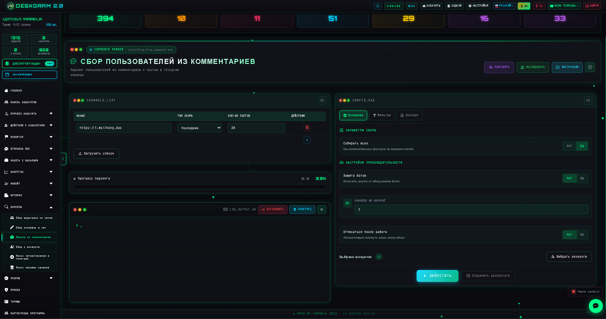
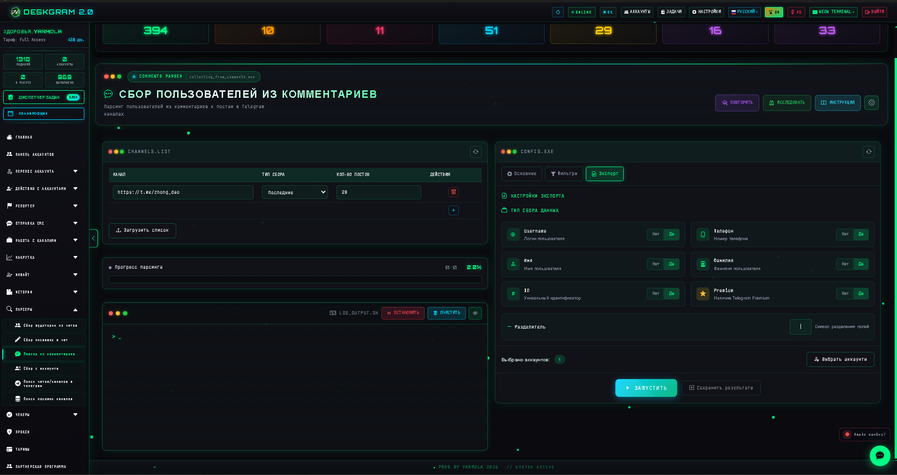
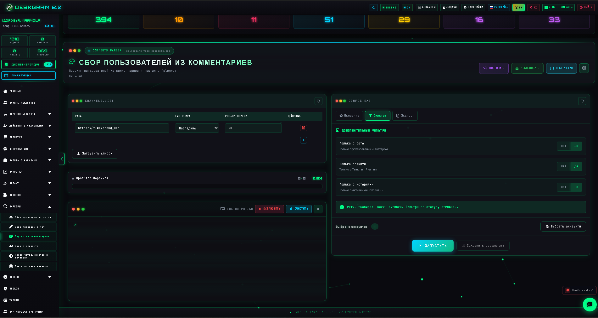
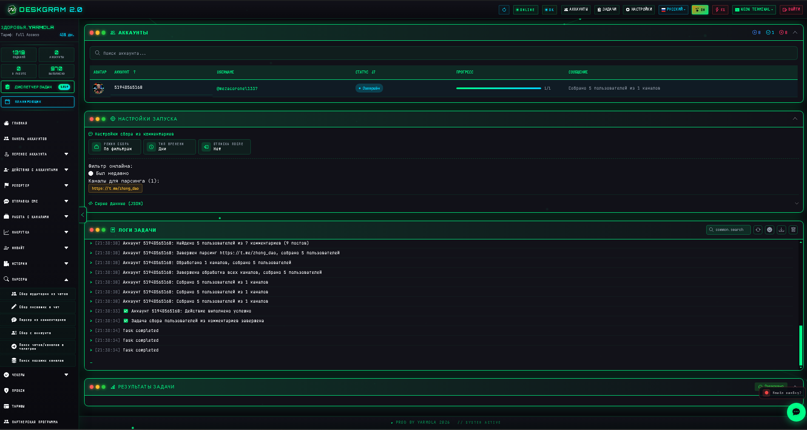

# Сбор аудитории из комментариев Telegram через Deskgram 2

Сбор пользователей из комментариев в Deskgram 2 нужен для сценариев, где важно найти живую аудиторию, уже проявившую активность под постами. Это полезно для исследовательских задач, сегментации, дальнейшей коммуникации и построения более точной базы получателей.

[Главный хаб Deskgram 2](https://github.com/Deskgram-2/deskgram-2-telegram-automation) · [Сайт](https://deskgram2.com/) · [Telegram-бот](https://t.me/DG2welcomebot) · [Web preview](https://deskgram2.com/web-preview)

## Скриншоты

## Кратко о модуле

| Параметр | Что внутри |
|---|---|
| Основная задача | Сбор пользователей из комментариев Telegram-каналов |
| Важные блоки | Список каналов, фильтры, результаты, логи, настройки |
| Полезен для | Поиска активной аудитории, сегментации, подготовки базы под общение |
| Связанные модули | Сбор аудитории, Рассылка в ЛС, Поиск каналов |

## Что умеет модуль

- собирать пользователей из комментариев к постам;
- работать по списку выбранных каналов;
- использовать фильтры и ограничения;
- показывать прогресс и лог выполнения;
- готовить более точную базу для следующих модулей.

## Быстрый старт

1. Подготовьте список каналов, где есть активные комментарии.
2. Добавьте источники в модуль.
3. Настройте глубину и фильтры сбора.
4. Запустите задачу и контролируйте лог.
5. Передайте итоговую базу в модули коммуникации или дополнительного парсинга.

## Куда лучше вести собранную базу

- [Рассылка в ЛС](https://github.com/Deskgram-2/telegram-direct-messaging-deskgram), если после сбора нужен прямой outreach;
- [Нейрорассылка](https://github.com/Deskgram-2/telegram-neuro-mailing-deskgram), если база пойдет в AI-коммуникацию и прогрев;
- [Инвайт](https://github.com/Deskgram-2/telegram-invite-tool-deskgram), если комментарии используются как источник роста групп и каналов;
- [Панель аккаунтов](https://github.com/Deskgram-2/telegram-account-manager-deskgram), если нужно заранее подготовить инфраструктуру под обработку базы;
- [Диспетчер задач](https://github.com/Deskgram-2/telegram-task-manager-deskgram), если вы отслеживаете парсинг и последующие сценарии из одного места.

## Как устроен сценарий

### Источники

В начале выбираются каналы, из комментариев которых нужно собирать аудиторию. Это важный этап, потому что качество источников влияет на релевантность всей базы.

### Фильтрация

Модуль позволяет ограничивать сбор и не тянуть подряд всех пользователей без разбора. Это помогает получать более чистый список.

### Результаты

После завершения сценария база готова для дальнейшей работы: от ручного анализа до рассылки и AI-коммуникации.

## Когда особенно полезен

- когда нужна аудитория, которая уже проявляет активность;
- когда важнее не просто объем, а признаки вовлеченности;
- когда вы строите связку "поиск каналов -> комментарии -> коммуникация";
- когда хотите получить более теплую базу, чем из общего поиска.

## Почему это полезнее общего сбора

| Общий сбор | Сбор из комментариев в Deskgram 2 |
|---|---|
| Аудитория часто слишком широкая | База строится вокруг реальной активности |
| Сложнее оценить интерес пользователя | Комментарии дают дополнительный сигнал вовлеченности |
| Много шума | Можно работать по выбранным каналам и фильтрам |
| Сложнее строить точечную коммуникацию | Получается более прикладная база |

## Что выбрать: сбор из комментариев или сбор писавших в чатах

| Если задача такая | Лучше использовать |
|---|---|
| Нужна база из активности под постами | [Сбор из комментариев](https://github.com/Deskgram-2/telegram-comment-audience-parser-deskgram) |
| Нужна база из живых обсуждений в чатах | [Сбор писавших в чатах](https://github.com/Deskgram-2/telegram-active-chat-users-parser-deskgram) |
| Нужна самая теплая discovery-база из нескольких типов активности | Комбинировать оба модуля |
| Нужен путь `каналы -> комментарии -> outreach` | Сбор из комментариев |

## FAQ для рабочих сценариев

### Когда этот модуль лучше обычного общего parser-а?

Когда вам важен не просто объем базы, а признак вовлеченности. Комментарии уже дают более сильный сигнал интереса, чем общий список участников.

### Когда такую базу логичнее вести в ЛС, а когда в инвайт?

Если нужен личный контакт и прогрев, база логичнее идет в [рассылку в ЛС](https://github.com/Deskgram-2/telegram-direct-messaging-deskgram). Если активная аудитория используется для роста сообщества, можно вести ее в [инвайт](https://github.com/Deskgram-2/telegram-invite-tool-deskgram).

### Что сильнее всего влияет на качество такого сбора?

Релевантность самих каналов, глубина комментарной активности и то, насколько аккуратно вы отбираете источники, а не собираете подряд все площадки.

## Смежные репозитории

- [Главный хаб Deskgram 2](https://github.com/Deskgram-2/deskgram-2-telegram-automation)
- [Поиск каналов и групп](https://github.com/Deskgram-2/telegram-channel-search-deskgram)
- [Сбор аудитории](https://github.com/Deskgram-2/telegram-audience-parser-deskgram)
- [Рассылка в ЛС](https://github.com/Deskgram-2/telegram-direct-messaging-deskgram)
- [Нейрорассылка](https://github.com/Deskgram-2/telegram-neuro-mailing-deskgram)
- [Инвайт](https://github.com/Deskgram-2/telegram-invite-tool-deskgram)
- [Панель аккаунтов](https://github.com/Deskgram-2/telegram-account-manager-deskgram)
- [Диспетчер задач](https://github.com/Deskgram-2/telegram-task-manager-deskgram)

## FAQ

### Чем этот модуль отличается от общего сбора аудитории?

Он делает акцент именно на пользователях, которые уже писали комментарии под постами.

### Это подходит для более теплой базы?

Во многих сценариях да, потому что активность в комментариях — уже полезный сигнал.

### Можно ли использовать эти данные дальше в рассылке?

Да. Это один из самых логичных следующих шагов.
